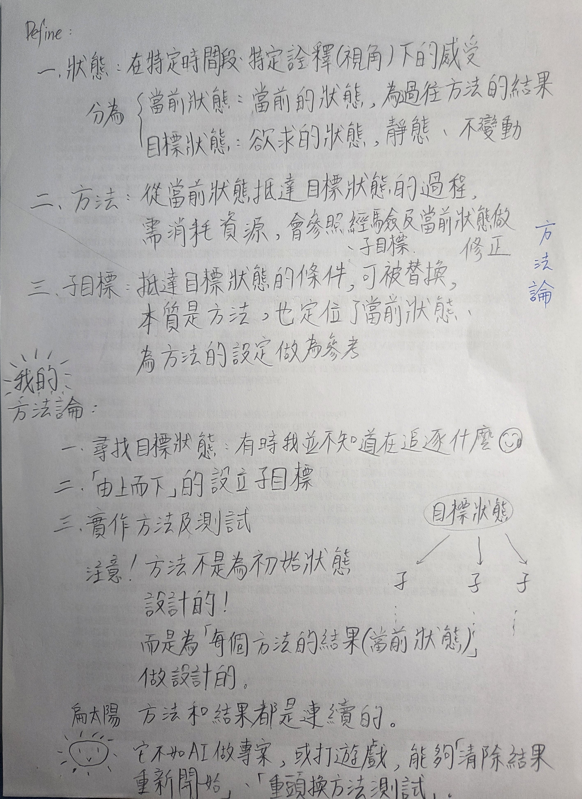

## Define:

1. **狀態**：在特定時間段、特定詮釋（視角）下的感受
   * **當前狀態**：當前的狀態，為過往方法的結果
   * **目標狀態**：欲求的狀態，靜態、不變動
2. **方法**：從當前狀態抵達目標狀態的過程，需消耗資源，會參照經驗及當前狀態做修正、子目標。
3. **子目標**：抵達目標狀態的條件，可被替換，本質是方法，也定位了當前狀態，為方法的設定做為參考。

---

## 我的方法論：

1. **尋找目標狀態**：有時我並不知道在追逐什麼
2. **「由上而下」的設立子目標**
3. **實作方法及測試**

> **注意！**
> 方法不是為初始狀態設計的！而是為「每個方法的結果（當前狀態）」做設計的。

**備註**  
方法和結果都是連續的。  
<<<<<<< HEAD
它不如 AI 做專案，或打遊戲，能夠「清除結果重新開始」、「重頭換方法測試」。  

=======
它不如 AI 做專案，或打遊戲，能夠「清除結果重新開始」、「重頭換方法測試」。

>>>>>>> 5020f9da0b6b6b77cea67a661e7b4f179cdbdd8e
